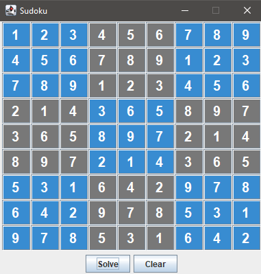

## SudokuSolver
SudokuSolver is a program which solves sudokus with recursive backtracking.

The program was built for the course [Programmering i Java - fortsättningskurs](http://cs.lth.se/edaa30/) at Lunds Tekniska Högskola. 

### Disclaimer
Since the program checks through all possible solutions, it can sometimes be very slow.

### Application picture

### Authors
Johan Wulf and Max Palmgren